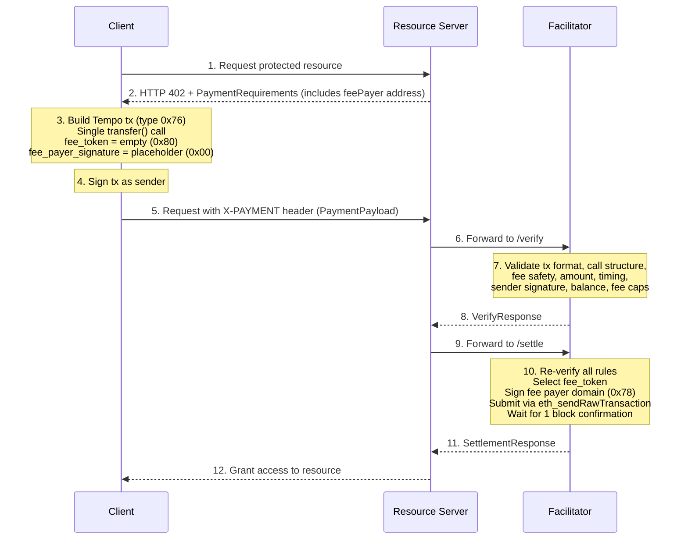

# Scheme: `exact` on `Tempo`

## Protocol Flow Diagram



---

## Summary

The `exact` scheme on Tempo executes a token transfer where the Facilitator pays the gas fees using Tempo's native fee sponsorship mechanism. The Client constructs a Tempo transaction (type `0x76`) containing a single `transfer(address,uint256)` call on a TIP-20 token contract, signs it as the sender, and submits the serialized transaction to the Facilitator. The Facilitator adds its fee payer signature, selects the fee token, and broadcasts the fully-signed transaction.

Unlike EVM chains where `transferWithAuthorization` (EIP-3009) or `Permit2` are used for gasless transfers, Tempo's custom transaction type has **native fee sponsorship** built into the transaction envelope. This eliminates the need for proxy contracts, on-chain approvals, or token-level authorization functions.

| Property | EVM (EIP-3009) | EVM (Permit2) | SVM | **Tempo** |
|:---|:---|:---|:---|:---|
| Asset transfer method | `transferWithAuthorization` | `permitWitnessTransferFrom` | `TransferChecked` instruction | `transfer(address,uint256)` in calls array |
| Fee sponsorship | Facilitator pays gas natively | Facilitator pays gas natively | Facilitator is `feePayer` on tx | Native `fee_payer_signature` field |
| Client sends | EIP-712 signature + authorization | EIP-712 signature + permit2 auth | Base64 partially-signed tx | Hex serialized `0x76` tx |
| Replay protection | Nonce in authorization | Nonce in permit | Blockhash expiry | Chain nonce + `validBefore`/`validAfter` |
| One-time setup | None | Permit2 approval | None | **None** |
| Gas currency | Native ETH | Native ETH | Native SOL | **Stablecoins (TIP-20)** |

---

## Protocol Flow

1. **Client** makes a request to a **Resource Server**.

2. **Resource Server** responds with HTTP `402 Payment Required` containing `PaymentRequirements`. The `extra` field MUST contain a `feePayer` address — the Facilitator's public address on Tempo that will sponsor gas fees.

3. **Client** constructs a Tempo transaction (type `0x76`) with:
   - A single entry in the `calls` array: a call to the required TIP-20 token contract with `transfer(address,uint256)` encoded as the call data.
   - `chainId` set to `42431`.
   - `validBefore` and `validAfter` set to define the payment's validity window.
   - The `fee_token` field encoded as empty (`0x80`), delegating fee token selection to the fee payer.
   - The `fee_payer_signature` field set to the placeholder value `0x00`.

4. **Client** signs the transaction as the sender. The sender signature MUST be computed with `fee_token` encoded as `0x80` (empty) and `fee_payer_signature` as `0x00` (placeholder). This allows the fee payer to choose `fee_token` later without invalidating the sender signature.

5. **Client** hex-encodes the serialized transaction (which MUST be prefixed with `0x76`) and constructs a `PaymentPayload`.

6. **Client** sends a new request to the **Resource Server** with the `PaymentPayload` in the `X-PAYMENT` header.

7. **Resource Server** forwards the `PaymentPayload` and `PaymentRequirements` to the **Facilitator Server's** `/verify` endpoint.

8. **Facilitator** deserializes and inspects the transaction according to the [Verification Rules](#facilitator-verification-rules-must).

9. **Facilitator** returns a `VerifyResponse` to the **Resource Server**.

10. **Resource Server**, upon successful verification, forwards the payload to the Facilitator's `/settle` endpoint.

11. **Facilitator** adds its fee payer signature (signing in the fee payer domain with magic byte `0x78`, committing to the sender address and the chosen `fee_token`), serializes the fully-signed transaction, and submits it via `eth_sendRawTransaction` to the Tempo network.

12. **Facilitator** waits for 1 block confirmation and responds with a `SettlementResponse`.

13. **Resource Server** grants the **Client** access to the requested resource.

---

## `PaymentRequirements` for `exact` on Tempo

In addition to the standard x402 `PaymentRequirements` fields, the `exact` scheme on Tempo requires the following inside the `extra` field:

```json
{
  "scheme": "exact",
  "network": "tempo:42431",
  "amount": "1000000",
  "asset": "0x20c0000000000000000000000000000000000000",
  "payTo": "0x209693Bc6afc0C5328bA36FaF03C514EF312287C",
  "maxTimeoutSeconds": 60,
  "extra": {
    "feePayer": "0xFacilitatorAddressHere",
    "feeTokenHint": "0x20c0000000000000000000000000000000000000",
    "gasLimitMax": "120000",
    "maxFeePerGasMax": "2000000000",
    "maxPriorityFeePerGasMax": "2000000000"
  }
}
```

| Field | Description |
|:---|:---|
| `scheme` | MUST be `"exact"`. |
| `network` | Network identifier. MUST be `"tempo:<chainId>"` (e.g., `"tempo:42431"`). |
| `amount` | The required payment amount in the token's smallest unit (e.g., `"1000000"` = 1.00 pathUSD with 6 decimals). |
| `asset` | The TIP-20 token contract address. |
| `payTo` | The recipient address (merchant/resource server). |
| `maxTimeoutSeconds` | Maximum time window for the payment to be settled. |
| `extra.feePayer` | **REQUIRED.** The Facilitator's public address on Tempo that will pay transaction fees. The Client needs this to construct the transaction correctly. |
| `extra.feeTokenHint` | Optional. Preferred fee token address. The fee payer MAY override this based on its own policy. |
| `extra.gasLimitMax` | Optional. Maximum `gas_limit` the fee payer will accept. Protects the fee payer from excessive gas costs. |
| `extra.maxFeePerGasMax` | Optional. Maximum `max_fee_per_gas` the fee payer will accept. |
| `extra.maxPriorityFeePerGasMax` | Optional. Maximum `max_priority_fee_per_gas` the fee payer will accept. |

---

## `PaymentPayload` `payload` Field

The `payload` field of the `PaymentPayload` contains:

```json
{
  "serializedTransaction": "0x76...",
  "transfer": {
    "token": "0x20c0000000000000000000000000000000000000",
    "from": "0x857b06519E91e3A54538791bDbb0E22373e36b66",
    "to": "0x209693Bc6afc0C5328bA36FaF03C514EF312287C",
    "value": "1000000"
  }
}
```

| Field | Required | Description |
|:---|:---|:---|
| `serializedTransaction` | **MUST** | Hex-encoded serialized Tempo transaction. MUST be prefixed with `0x76` (the Tempo transaction type byte). Contains the sender's signature but NOT the fee payer signature. The `fee_payer_signature` MUST be the `0x00` placeholder, and `fee_token` MUST be encoded as `0x80` (empty). |
| `transfer` | **SHOULD** | Extracted transfer details for quick pre-validation by resource servers. The Facilitator MUST NOT rely on this field for security-critical checks — it MUST parse the serialized transaction directly. |
| `transfer.token` | SHOULD | The TIP-20 token contract address being called. |
| `transfer.from` | SHOULD | The sender's address. Used as a fallback when `from` cannot be recovered from the serialized transaction. |
| `transfer.to` | SHOULD | The transfer recipient address. |
| `transfer.value` | SHOULD | The transfer amount in the token's smallest unit. |

Full `PaymentPayload` object:

```json
{
  "x402Version": 2,
  "resource": {
    "url": "https://api.example.com/premium-data",
    "description": "Access to premium market data",
    "mimeType": "application/json"
  },
  "accepted": {
    "scheme": "exact",
    "network": "tempo:42431",
    "amount": "1000000",
    "asset": "0x20c0000000000000000000000000000000000000",
    "payTo": "0x209693Bc6afc0C5328bA36FaF03C514EF312287C",
    "maxTimeoutSeconds": 60,
    "extra": {
      "feePayer": "0xFacilitatorAddressHere",
      "feeTokenHint": "0x20c0000000000000000000000000000000000000",
      "gasLimitMax": "120000",
      "maxFeePerGasMax": "2000000000",
      "maxPriorityFeePerGasMax": "2000000000"
    }
  },
  "payload": {
    "serializedTransaction": "0x76...",
    "transfer": {
      "token": "0x20c0000000000000000000000000000000000000",
      "from": "0x857b06519E91e3A54538791bDbb0E22373e36b66",
      "to": "0x209693Bc6afc0C5328bA36FaF03C514EF312287C",
      "value": "1000000"
    }
  }
}
```

---

## `SettlementResponse`

The `SettlementResponse` for the `exact` scheme on Tempo:

```json
{
  "success": true,
  "transaction": "0xabc123...",
  "network": "tempo:42431",
  "payer": "0x857b06519E91e3A54538791bDbb0E22373e36b66"
}
```

| Field | Description |
|:---|:---|
| `success` | `true` if the transaction was confirmed on-chain. |
| `transaction` | The transaction hash (hex-encoded, `0x`-prefixed). |
| `network` | Network identifier (`"tempo:42431"`). |
| `payer` | The sender's address (the user who paid, not the fee payer/facilitator). |

---

## Facilitator Verification Rules (MUST)

A facilitator verifying an `exact`-scheme Tempo payment MUST enforce **all** of the following checks before sponsoring and signing the transaction:

### 1. Transaction Format

- The `serializedTransaction` MUST start with `0x76` (the Tempo transaction type byte, per EIP-2718).
- The transaction MUST deserialize successfully using the Tempo transaction format.
- The transaction's `chainId` MUST equal `42431`.

### 2. Sponsored Intent

- The `fee_payer_signature` field MUST be present as a placeholder (`0x00`) in the sender-signed transaction.
- The `fee_token` field MUST be empty (encoded as `0x80`) in the sender-signed transaction, so the fee payer can select a token.

> **Rationale:** These placeholders prove the sender explicitly intends for this transaction to be fee-sponsored. Requiring specific placeholder values prevents ambiguity and ensures the sender signature was computed correctly for the sponsored flow.

### 3. Calls Array Layout

- The transaction MUST contain **exactly 1** entry in the `calls` array.
- The single call's `to` field (the contract being called) MUST be a supported TIP-20 token address.
- The call's `data` field MUST begin with the function selector `0xa9059cbb` (`transfer(address,uint256)`).
- The call data MUST be exactly 68 bytes: 4-byte selector + 32-byte address parameter + 32-byte uint256 parameter.
- The call's `value` MUST be `0`.

> **Rationale:** Restricting to exactly 1 call with the `transfer` selector ensures the fee payer only sponsors simple token transfers. Allowing multiple calls or arbitrary selectors would open the door to unintended operations executed at the fee payer's expense.

### 4. Fee Payer Safety

- The configured fee payer address MUST NOT be the `from` (sender) of the transaction.
- The fee payer MUST NOT be the decoded recipient (`to` parameter) of the `transfer()` call.
- The fee payer MUST NOT be the token contract address (the `to` field of the call in the calls array).

> **Rationale:** These checks prevent the fee payer from being tricked into transferring its own funds, receiving funds it shouldn't (creating accounting confusion), or having its gas sponsorship abused for calls to arbitrary contracts.

### 5. Transfer Intent and Destination

- The token contract address (call target) MUST match `PaymentRequirements.asset` (case-insensitive comparison).
- The decoded `to` parameter of the `transfer()` call MUST match `PaymentRequirements.payTo` (case-insensitive comparison).
- The decoded `amount` parameter of the `transfer()` call MUST be **greater than or equal to** `PaymentRequirements.amount`.

### 6. Timing Validity

- If `validBefore` is non-zero, the current timestamp MUST be **less than** `validBefore`.
- If `validAfter` is non-zero, the current timestamp MUST be **greater than or equal to** `validAfter`.
- Implementations SHOULD reject transactions where `validBefore` is set to an unreasonably far future (e.g., > `maxTimeoutSeconds` from now) to limit replay windows.

### 7. Sender Signature

- The transaction MUST contain a valid sender signature in the `signature` field.
- The sender signature MUST have been computed with `fee_token` as `0x80` (empty) and `fee_payer_signature` as `0x00` (placeholder).
- The address recovered from the sender signature MUST match the `from` address of the transaction.
- If the `from` address cannot be directly extracted from the serialized transaction, the facilitator MAY use the `payload.transfer.from` field but MUST verify it is consistent with the recovered signer.

### 8. Fee Safety Caps

- `gas_limit` in the transaction MUST be less than or equal to the configured cap. If `extra.gasLimitMax` is provided in the `PaymentRequirements`, use that value; otherwise use the facilitator's default cap.
- `max_fee_per_gas` in the transaction MUST be less than or equal to the configured cap. If `extra.maxFeePerGasMax` is provided, use that value; otherwise use the facilitator's default cap.
- `max_priority_fee_per_gas` in the transaction MUST be less than or equal to the configured cap. If `extra.maxPriorityFeePerGasMax` is provided, use that value; otherwise use the facilitator's default cap.

> **Rationale:** Without fee caps, a malicious client could construct a transaction with an extremely high gas limit or fee, causing the fee payer to spend far more on gas than the value of the transfer being sponsored.

### 9. Balance Check

- The sender MUST have a TIP-20 token balance **greater than or equal to** the transfer amount at the time of verification.
- The facilitator SHOULD query the token contract's `balanceOf(sender)` to confirm this.

### 10. Network Validation

- `PaymentRequirements.network` MUST equal `"tempo:42431"`.

---

## Settlement Logic

Upon successful verification, the Facilitator settles the payment by executing the following steps:

1. **Re-verify** all checks from the Verification Rules. Settlement MUST NOT proceed if any check fails.

2. **Deserialize** the Tempo transaction from `payload.serializedTransaction`.

3. **Select fee token.** The Facilitator chooses a TIP-20 token to pay gas fees. If `extra.feeTokenHint` is provided in the `PaymentRequirements`, the Facilitator SHOULD use it if policy allows. Otherwise, the Facilitator selects based on its own liquidity and operational preferences (typically pathUSD).

4. **Sign as fee payer.** The Facilitator creates a fee payer signature in the fee payer domain (magic byte `0x78`) over the transaction envelope using its private key. The fee payer signature MUST commit to the sender address and the chosen `fee_token`. This sets the `fee_token` and `fee_payer_signature` fields on the transaction.

5. **Integrity check.** The submitted transaction MUST only differ from the sender-signed version by the `fee_token` and `fee_payer_signature` fields. All other fields (calls, nonce, chainId, validity window, etc.) MUST remain unchanged.

6. **Serialize** the fully-signed transaction (now containing both sender signature and fee payer signature).

7. **Submit** the transaction via `eth_sendRawTransaction` to the Tempo RPC endpoint.

8. **Wait** for 1 block confirmation.

9. **Return** `SettlementResponse`:
   - On success: `{ success: true, transaction: <hash>, network: "tempo:42431", payer: <sender_address> }`
   - On revert: Return failure with error code `TRANSACTION_REVERTED`.
   - On timeout: The facilitator SHOULD still return success if the transaction was submitted, as it may confirm in a subsequent block.

---

## Security Considerations

### Fee Payer Fund Safety

The fee payer (Facilitator) cannot be tricked into transferring its own funds because:

- The `calls` array is restricted to exactly 1 call with the `transfer(address,uint256)` selector.
- The fee payer address is checked against all transaction participants (sender, recipient, token contract).
- No arbitrary contract calls are possible — only the whitelisted `transfer` function selector is accepted.
- The fee payer only pays gas; the transfer of funds is from the sender's balance via the signed `transfer()` call.
- Fee safety caps prevent the fee payer from being forced to overpay on gas.

### Fee Payer Signature Domain

The fee payer signs in a separate domain (magic byte `0x78`) that commits to:

- The sender address
- The chosen `fee_token`
- The full transaction envelope

This domain separation ensures the fee payer signature cannot be confused with a sender signature. The fee payer signature is an envelope over the sender-signed transaction. Neither party can modify the other's signed portion after signing.

### Sender Signature Integrity

The sender's signature covers the entire transaction content including:

- The `calls` array (token contract address, function selector, parameters)
- `chainId`
- `validBefore` and `validAfter`
- Nonce

The sender signature is computed with `fee_token` as `0x80` (empty) and `fee_payer_signature` as `0x00` (placeholder). This deterministic encoding ensures the sender's signature is valid regardless of which fee token the fee payer ultimately selects.

### Replay Protection

Tempo transactions use standard EVM-style nonces managed by the chain. Each sender address has a monotonically incrementing nonce, preventing transaction replay. The `validBefore`/`validAfter` window further limits the time a payment proof can be held before submission.

### Fee Token Delegation

The sender signs the transaction with a **blank fee token field** (`0x80`), explicitly delegating fee token choice to the fee payer. This is by design — the fee payer selects the optimal fee token based on its liquidity and operational preferences. The sender's funds are protected because only the `calls` array (which the sender signs) determines fund movement. The fee token field only affects which stablecoin is used to pay gas.

### Stablecoin Gas

Tempo has no native token. All transaction fees are paid in TIP-20 stablecoins. The Facilitator must maintain sufficient stablecoin balance in its fee payer account to cover gas fees. This is an operational requirement, not a protocol-level security concern. Tempo's fixed base fee ensures gas costs remain predictable (< $0.001 per TIP-20 transfer).

---

## Optional Extensions (Non-Normative)

- **Batch calls**: Allow multiple TIP-20 transfers in a single Tempo transaction (requires expanded verification rules to validate each call in the `calls` array).
- **TransferWithMemo**: Permit `transferWithMemo` if memo binding to the resource is needed.
- **Nonce key policies**: Use dedicated `nonce_key` ranges for x402 to improve parallelism and replay isolation.

---

## Annex

### Transfer Call Data Encoding

The `transfer(address,uint256)` call data is ABI-encoded as follows:

```
Offset  Length  Content
──────  ──────  ───────────────────────────────────────────
0x00    4       Function selector: 0xa9059cbb
0x04    32      address to    (left-padded with zeros to 32 bytes)
0x24    32      uint256 amount (big-endian, 32 bytes)
```

Total: 68 bytes (4 + 32 + 32).

Example for transferring 1,000,000 units to `0x209693Bc6afc0C5328bA36FaF03C514EF312287C`:

```
0xa9059cbb
000000000000000000000000209693bc6afc0c5328ba36faf03c514ef312287c
00000000000000000000000000000000000000000000000000000000000f4240
```

### Fee Payer Signature Encoding

The fee payer signature is computed over the fee payer domain, identified by magic byte `0x78`:

```
fee_payer_signing_payload = 0x78 || rlp(chain_id, sender_address, fee_token, sender_signed_hash)
```

The resulting signature is placed in the `fee_payer_signature` field of the transaction envelope.

### Known TIP-20 Tokens

| Token | Address | Decimals | Notes |
|:---|:---|:---|:---|
| pathUSD | `0x20c0000000000000000000000000000000000000` | 6 | Precompile address on Tempo |

### Tempo Chain Configuration

| Property | Value |
|:---|:---|
| Chain ID | `42431` |
| Network ID | `tempo:42431` |
| Transaction Type | `0x76` (TempoTransaction, EIP-2718 envelope) |
| RPC Interface | Standard JSON-RPC (`eth_sendRawTransaction`, `eth_call`, etc.) |
| Native Token | None (fees paid in TIP-20 stablecoins) |
| Base Fee | Fixed (< $0.001 per TIP-20 transfer) |
| Block Confirmation | 1 block recommended |
| Fee Payer Domain | Magic byte `0x78` |
| Sender Placeholder Encoding | `fee_token` = `0x80`, `fee_payer_signature` = `0x00` |
| Fee Payer Service (Testnet) | `https://sponsor.moderato.tempo.xyz` |
